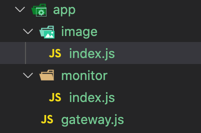

# 安装

1. 第一步, 全局安装

```bash
npm install -g oox
```

2. 第二步 *(非必要)*, 项目安装

```bash
npm install oox
```

# 使用方法
## 最简单用法

1. 创建文件 `entry.js`:

```javascript
exports.do = ( msg ) => {
    return 'msg:' + msg
}
```

2. 启动服务

```bash
oox entry.js port=3001
```

3. 访问服务

<!-- tabs:start -->

#### **HTTP**

```bash
POST / HTTP/1.1
Host: 127.0.0.1:3001
Content-Type: application/json
Content-Length: 68

{
    "action": "do",
    "params": [
        "hello world!"
    ]
}
```

#### **cURL**

```bash
curl --location --request POST 'http://127.0.0.1:3001/' \
--header 'Content-Type: application/json' \
--data-raw '{
    "action": "do",
    "params": [
        "hello world!"
    ]
}'
```

#### **HTTPie**

```bash
http :3001 action=do params='hello world!'
```

<!-- tabs:end -->

## 多服务及节点扩展

### 规则与限制
#### 命名

* 微服务模式, 服务只能通过`服务名.js`或者`服务名/index.js`访问到
* 单例模式 (只有一个实例节点, 但也通过微服务模块化的方式开发) 则不受限制

    一个拥有`gateway`/`image`/`monitor`3个服务, 目录结构可能是这样:
    

#### 服务间调用

* 微服务模式, 远程调用是异步的, 返回的是`Promise`对象, 请使用 `async/await`
* 单例模式, 纯本地调用, 返回结果是什么取决于被调用服务接口返回什么

#### 特殊说明

* 微服务模式, 需要指定`group`(服务集目录)和`registry`(一个或多个注册服务地址)

### 示例

我们模拟一个图像文字识别服务(OCR), 命名为`gateway`的服务接收到客户端的处理请求, 发送给命名为`image`的服务进行处理

1. 创建服务集文件夹, 比如 `app`
2. 在`app`目录下创建图像处理服务`image/index.js`:

```javascript
// 图片处理服务

exports.OCR = async ( imageURL ) => {

    // 1. 下载图片
    // 2. 识别文字
    // 3. 返回结果

    console.log ( '正在识别', imageURL )

    return {
        url: imageURL,
        text: '这是图片上的文字'
    }
}
```

3. 在`app`目录下创建网关服务`gateway/index.js`:

```javascript
// 外部访问网关

const Image = require ( '../image' )

exports.OCR = async ( imageURL ) => {

    const { url, text } = await Image.OCR ( imageURL )

    return text
}
```

4. 启动服务

<!-- tabs:start -->

#### **单例模式**

```bash
oox app/gateway/index.js port=7000
```

#### **微服务模式**

1. 启动网关服务, 指定端口为`7000`, 如果不指定`group`, 就成了单例模式

```bash
oox group=app/ app/gateway/index.js port=7000
```

2. 启动图片处理服务, 使用随机端口, 注册地址选择任意已启动的服务地址即可

```bash
oox group=app/ registry=:7000 app/image/index.js
```

<!-- tabs:end -->

5. 访问服务

<!-- tabs:start -->

#### **HTTP**

```bash
POST / HTTP/1.1
Host: 127.0.0.1:7000
Content-Type: application/json

{
    "action": "OCR",
    "params": [
        "http://example.com/test-image.png"
    ]
}
```

#### **cURL**

```bash
curl --location --request POST 'http://127.0.0.1:7000/' \
--header 'Content-Type: application/json' \
--data-raw '{
    "action": "OCR",
    "params": [
        "http://example.com/test-image.png"
    ]
}'
```

#### **HTTPie**

```bash
http :7000 action=OCR params='http://example.com/test-image.png'
```

<!-- tabs:end -->

6. 增加服务节点

    只需重复启动服务, 指定不同的端口即可

    至此, 一个高可用的服务集群, 就建立起来了


## 命令行参数解释

### env

1. 释义

    环境变量文件地址, 指定一个`.js`或者`.json`文件, 需要说明的是, 这里指定的环境变量, 不会合并到 `process.env` 里面, 只能通过 `oox.变量名称` 访问

2. 使用方法:

    比如我们的环境变量文件 `env.js`:
    ```javascript
    module.exports = {
        redis_url: 'redis://127.0.0.1:6379/9'
    }
    ```

    启动服务时, 指定 `env=env.js`:
    ```bash
    oox env=env.js
    ```

    在应用内使用时:
    ```javascript
    var redis_url = oox.redis_url
    ```

### default-env

1. 释义 

    和 `env` 一样, 不过里面的变量名和 `env` 里面有相同的, 则会被 `env` 里面的覆盖

    一般使用时, 里面填写所有服务都共用的变量或者常量, `env` 里面则填写服务单独的变量

### port

1. 释义

    指定服务监听的端口, 不设置时, 为随机端口

### group

1. 释义

    微服务专用, 指定服务集文件夹, 不设置的话, 就是单例模式本地调用

### ignore

1. 释义

    微服务专用, 指定哪些服务不需要映射成远程调用, 只需本地调用

2. 使用方法:

    比如我们有 `a`/`b`/`core` 三个服务, `core` 服务内都是整个系统所需的比如数据库建模, 分布式锁, 核心业务逻辑等等

    在启动服务时, 可以选择不把对 `core` 的调用映射成远程调用:
    ```bash
    oox group=app/ ignore=core app/a.js
    oox group=app/ ignore=core app/b.js
    ```

    这样操作, `a`/`b` 之间调用是远程调用, 但他们对 `core` 的调用是本地调用

### http

1. 释义

    单独设置HTTP服务监听信息

2. 使用方法:

    * 不开启HTTP服务
    ```bash
    oox http=null
    ```

    * 设置HTTP监听端口和路径
    ```bash
    oox http='{"port":8080,"path":"my_api_path"}'
    ```

### socketio

1. 释义

    同http一样, 单独设置SocketIO服务的监听信息, 不设置的话就是和HTTP一样的端口, 默认路径是`/socket.io`

### registry

1. 释义

    注册服务地址, 可设置多个, 通常只用于服务启动时的首次服务发现, 需要特别说明的是, 注册服务必须开启`SocketIO`服务

2. 使用方法

    * 当前主机内, 只设置端口, 多个端口或地址, 用`,`隔开
    ```bash
    oox registry=:7000,:7001,:7002
    ```

    * 注册服务不在当前主机, 需要指定IP地址, 多个端口或地址, 用`,`隔开
    ```bash
    oox registry=10.0.0.11:7000,10.0.0.12:7000,10.0.0.13:7000
    ```

### origin

1. 释义

    浏览器跨域访问专用, 指定 `Web` 浏览器域, 可以设置 `*` 表示所有域可访问, 或者设置 `http(s)://域名`, 可设置多个, 用`,`隔开